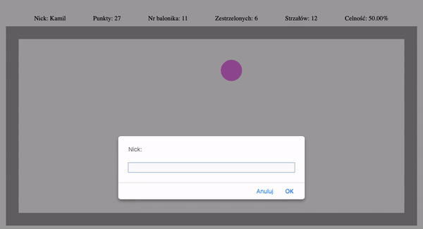
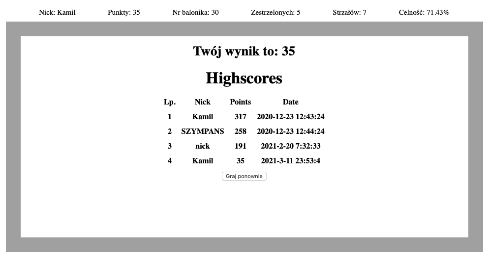

Balloons Game
---

Technologies used:
- Javascript
- HTML
- CSS
- Fetch API

### What is Ballons Game?

Balloons Game is game in which participant have to pop the balloons as quickly as possible.
Initially there is 2s for each balloon but with each turn time shorten.
The faster you pop the more points you get.
If you miss you lose points.

